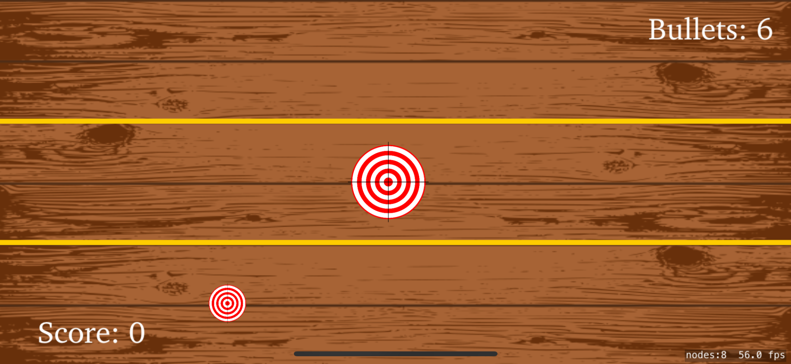
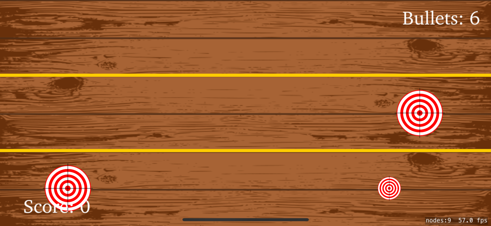
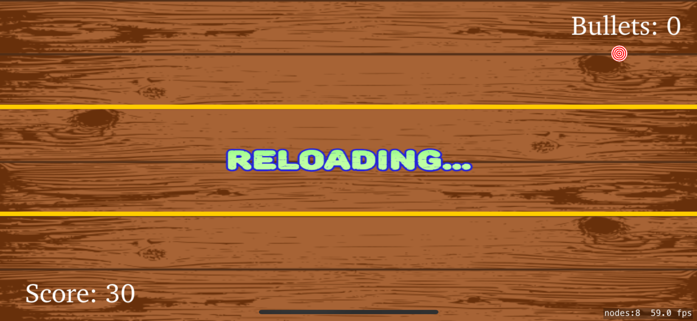

# Shooting Range — game for IOS App

### Test your reaction and accuracy by hitting targets without hitting people, and remember the classic shooting range.

  
  
   
  
  
   
  
  

## Overview
Welcome to the classic shooting range with various objectives, including those where fire is prohibited, score points and time limit.

## Features
 * There are four types of targets: small and fast, medium slower, large and slow, as well as people who are prohibited from shooting (points are deducted if they are hit)
 * The limit is 5 minutes per round of shooting
 * Reload every five bullets

## Technologies
 * SpriteKit
 * Timer
 * Bit masks
